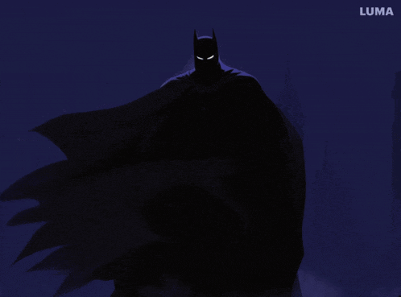
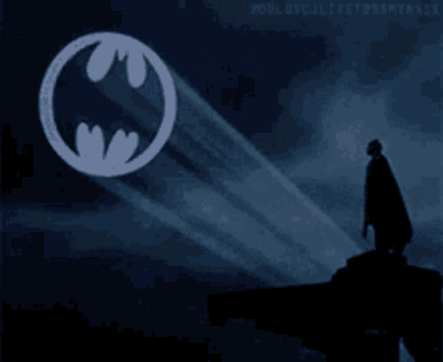

  

# Hi... I'm Marcus  

A **Front-end | Web Developer** An advocate for creating **responsive**, **accessible**, and **inclusive digital interfaces** that deliver intuitive and engaging experiences on the web.

<h3 align="left">Connect with me!</h3>

[.svg)](https://www.linkedin.com/in/marcus-vinicius-moreira-front-end/)
[.svg)](https://www.instagram.com/88x88y/)
[.svg)](https://x.com/88x88y)

<h3 align="left">My Stack ~</h3>

  
  
  
  
  
  
  
  
  
  
  
  

<picture align="center">
  <source media="(prefers-color-scheme: dark)" srcset="https://raw.githubusercontent.com/rateryyz/rateryyz/output/github-contribution-grid-snake-dark.svg">
  <source media="(prefers-color-scheme: light)" srcset="https://raw.githubusercontent.com/rateryyz/rateryyz/output/github-contribution-grid-snake-dark.svg">
  
</picture>
